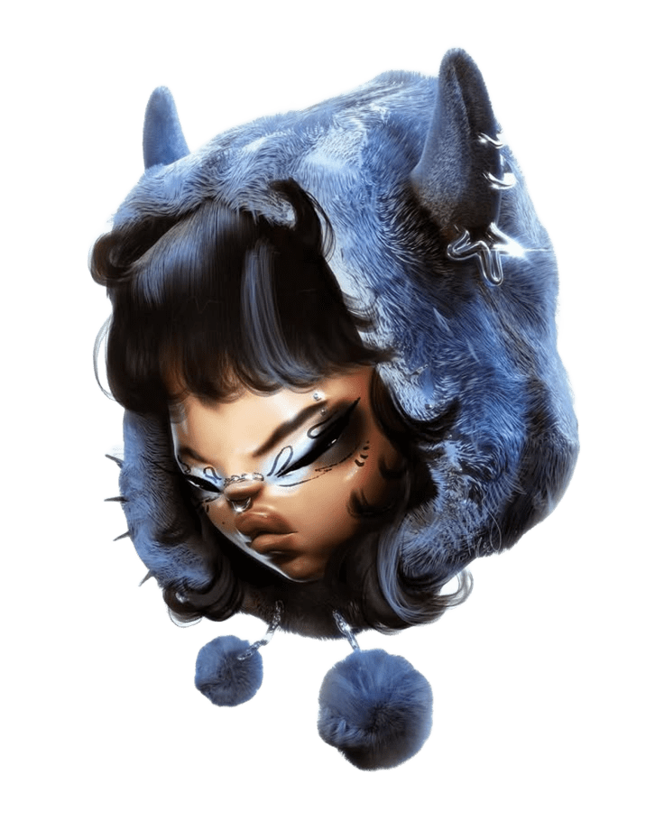

  <!-- Banner Principal - Use a imagem que tem o coelhinho azul ou a boneca de óculos -->
  

  <h1> ✦ Mariana Santos Silva ✦ </h1>
  
<i>"Criando mundos e mecânicas entre o código e a estética."</i>

  

<table>
  <tr>
    <td width="60%">
      <h2> 🌑 Sobre Mim </h2>
      

        Sou estudante de <b>Ciência da Computação</b> e desenvolvedora de jogos focada em <b>Unity (C#)</b> e <b>Godot</b>. 
        Gosto de unir a lógica pesada da programação com interfaces que tenham personalidade e estilo.
      

      

        🌌 <b>Foco:</b> Game Design, Arquitetura de Sistemas e UI/UX Vibrante. 
        💙 <b>Estética:</b> Apaixonada por designs minimalistas, escuros e modernos.
      

    </td>
    <td width="40%" align="center">
      <!-- Coloque aqui a imagem da bonequinha de óculos ou a azul com estrelas -->
      
    </td>
  </tr>
</table>

## 🛠️ Tecnologias & Habilidades

  <!-- Badges em Preto e Azul Royal -->
  
  
  
  
  

 

  <!-- Gráfico de dias seguidos (Streak) - Azul Royal -->
  
  <!-- Card de Linguagens - Azul Royal -->
  

<table>
  <tr>
    <td width="40%" align="center">
      <!-- Coloque aqui a imagem do coelhinho preto ou do personagem com chifres -->
      
    </td>
    <td width="60%">
      <h2> 🎮 O que eu desenvolvo </h2>
      <ul>
        <li><b>Jogos Autorais:</b> Foco em gêneros <i>Hyper Casual</i> e <i>Action Indie</i>.</li>
        <li><b>Sistemas:</b> Desenvolvimento de mecânicas de inventário e IA para inimigos.</li>
        <li><b>Web:</b> Experiências interativas usando React e Three.js.</li>
      </ul>
    </td>
  </tr>
</table>

## 🛰️ Vamos conectar?

  
  

 

  <i>"Code with purpose, systems with logic, and just enough chaos to keep it fun."</i> 
  

