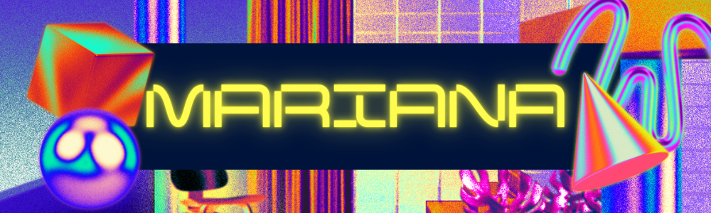

# Olá, eu sou a Mariana Santos Silva 👋

<p align="center">
  
</p>
---
### 🚀 Cursando Ciências da Computação | Game Developer
*Transformando ideias em formatos reais e divertidos.*

---

### 🌸 Sobre Mim
- 🎮 **Atuação:** Desenvolvedora com foco em Games (Unity/C#).
- 🎓 **Formação:** Estudante de Ciência da Computação.
- 🎯 **Especialidade:** Lógica de programação em **C#** e desenvolvimento de mecânicas.
- 🎨 **Interesses:** Além de código, gosto de criar interfaces intuitivas e vibrantes.

---

### 🛠️ Minhas Tecnologias
<p align="left">
  <a href="https://skillicons.dev">
    
  </a>
</p>

> **Nota:** Meus repositórios atuais são focados em **C#**, onde aplico conceitos de Game Design e Arquitetura.

---

### 📊 Estatísticas do GitHub

<p align="center">
  <!-- Quadro de Estatísticas Gerais (Rosa/Vermelho) -->
  

  <!-- Quadro de Linguagens Mais Usadas (Rosa/Vermelho) -->
  
</p>

---

📫 Vamos conversar?
<a href="https://www.linkedin.com/in/mariana-santos-silva-470645360" target="_blank">

</a>
<a href="mailto:marianasilva0786@gmail.com">

</a>
<p align="center">

</p>
```
